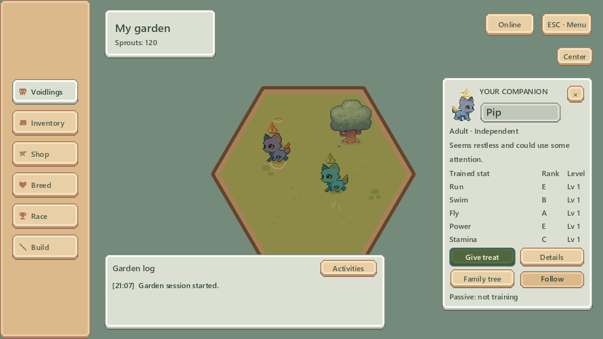

# Selected UI overhaul — staged implementation

Status: **Stage 1 implemented and verified; waiting for Garden player testing.** Each subsequent screen waits for the previous screen's player test.

Branch: `codex/ui-overhaul-managers-rail`  
Workspace: `C:/Users/Home/Documents/Voidling-ui-overhaul`  
Baseline: `e03691b` from main. No save schema, economy, genetics or race simulation changes.

## Approved visual combination

| Stage | Selected reference | Implementation and test gate |
|---|---|---|
| 1. Garden | 02 — Manager's rail | Warm premium wood rail at left; Voidlings, Inventory, Shop, Breed, Races, Build in that order. Status beside rail; quiet Online/ESC controls upper right; small Center control; compact selected-creature inspector right; readable log with Activities below the world. Stop for Garden playtesting. |
| 2. Shop | 04 — Keeper's ledger window, with 02's side rail replacing the top menu | Preserve option 04's paper window, category column, readable product rows and purchase receipt. Keep the manager's rail on the left. Preserve fixed egg identities, stock, prices and ownership. Stop for Shop playtesting. |
| 3. Race entry | 02 — Manager's rail | Course and creature selection beside the rail, clear selected entrant and one Start action. Stop for entry playtesting. |
| 4. Live race | 05 — Creature first | Player portrait, stamina and Cheer together at bottom centre; opponents right; course progress bottom left. Preserve existing simulation and local/online exit semantics. Stop for live-race playtesting. |
| 5. Results | 01 — Classic dock | Central podium and clear Return to garden action. Preserve rewards and one-time result handling. Stop for results playtesting. |

“Keeper's Leisure” in the selection refers to option 04, labelled Keeper's ledger in the studies.

## Stage 1 sequence

1. Reuse `UiFactory` premium panel/button atlas, premium icon sheet, existing system font and canonical `VoidlingVisualFactory` portraits. Match reference 02's composition at the existing 640×360 logical viewport (1280×720 desktop window), without changing world art or zoom rules.
2. Replace the bottom dock with a left rail. Open the existing searchable roster beside it. Keep world selection, petting, dragging and follow behavior.
3. Compact the right inspector: identity, stage/personality, qualitative care, five rank/level rows, Give treat / Details / Family / Follow, and passive-training status/Stop. Keep detailed statistics in Details and permanent departure behind Details with both existing confirmations. Treat choice calls the existing training action.
4. Move system access behind a mouse-accessible ESC menu. Escape first unwinds an open interaction; Settings returns to the menu. Menus do not pause Garden simulation. Keep camera recovery outside Settings.
5. Add Build → land/training grounds and decorations, plus log Activities → daily check-in and missions. Reuse current feature screens. The legacy Shop links are removed during the Shop stage, when that screen is replaced.
6. Extend the existing Garden runtime smoke to exercise rail destinations, roster selection, inspector, treat inventory consumption, ESC/back/focus behavior, and non-overlapping bounds. Run Debug/Release builds, tests and the Godot checks from CI, then inspect rendered Garden screenshots.
7. Provide the branch, workspace, screenshots, isolated-save launch command and a short player checklist. Do not start stage 2 until the user has tested and asked to proceed.

## Garden player checklist

- Find/select another Voidling through both the world and rail; search by name/color; follow and Center work.
- Read all five rank/level rows; give a treat; inspect Details and Family; stop passive training.
- Open every rail destination and return; Build reaches owned ground and decorations.
- Read and scroll the Garden log; Activities reaches rewards and missions.
- ESC opens the Garden menu, Settings returns to it, and returning restores usable focus/selection.
- Verify rail, log and inspector remain readable at 1280×720 and a larger desktop window; long names stay inside their panels.
- Pet/drag/pan around the UI; clicking UI must not select/drop a creature underneath it.

## Scope and source rules

The mockup is a layout reference, not new gameplay requirements. All balances, current save IDs, rewards, shop rolls and deterministic race outcomes remain authoritative in existing application/domain owners. Reuse premium Sprout Lands art with existing attribution; do not copy base creature atlases into UI consumers. Player-facing additions use localization keys. Existing standalone Settings/Shop/Details and modal ownership remain in place; no generic navigation framework is needed.

The original five-option rationale is in `UI_UX_OVERHAUL_OPTIONS.md`. This plan records the chosen combination and the per-screen test gates.

## Stage 1 handoff

Implemented the premium wood manager's rail, compact profile with persistent controls, real treat chooser, Build and Activities entry points, and ESC → Garden menu → Settings. The roster now opens beside the rail and focuses care after selection. Goodbye remains available through Details with both confirmations. The tutorial highlight follows the new Garden layout. Mouse clicks on the rail cannot place decorations underneath it; edge panning respects UI surfaces.

The Shop still uses its previous window until stage 2. Its legacy shortcuts remain for now; Missions now returns to Activities. Race entry, live race and results still use their previous layouts. No economy, creature simulation, race rules, network protocol or production persistence changes were made.



### Launch the isolated playtest

From this workspace in PowerShell:

```powershell
.\playgame.bat --no-build --voidling-dev-profile=ui_overhaul_playtest
```

This uses a separate development save. On its first launch, choose **Skip** in the tutorial to inspect the Garden immediately, or walk through the updated guide. Start with the Garden checklist above; send feedback before stage 2 begins.

### Verification completed

Local environment: Windows, .NET 8, Godot 4.6.1 Mono (CI uses Linux/Godot 4.6.0). Ran the checks represented in `.github/workflows/ci.yml`:

| Check | Result |
|---|---|
| Restore; Debug and Release builds | Pass; two existing warnings in `TradeNegotiationCoordinator` |
| Domain/application/presentation test project | 236 passed, zero failures |
| Architecture and canonical creature-art boundaries | Pass |
| Localization source and new Garden keys | Pass |
| Godot import and actual main-scene runtime | Pass; bundled asset duplicate-UID warnings remain |
| Garden interactions, actual pointer clicks, ESC, focus return/Tab containment, treat consumption, expanded inspector bounds, continued simulation | Pass |
| Rendered Garden review | Pass at 1280×720 and 1600×900; long name/favorite-food/training state checked |
| Voidling visual, race presentation, race completion and family-tree smoke | Pass |
| Persistence recovery and trade-panel smoke | Pass |
| Two-process LAN handshake and durable trade | Both peers passed and exited successfully |
| `git diff --check` | Pass |

Two existing test probes needed local-verification corrections: persistence corruption/cleanup now resolves the same development-profile path as its repository; the LAN trade probe uses normal Godot shutdown on Windows because exiting the CLR directly from a native callback failed after a completed trade. These changes are probe-only; the existing Linux workaround and production save/trade behavior remain unchanged.

The reusable Garden check is:

```text
godot --headless --path . -- --voidling-garden-ui-smoke --voidling-dev-profile=ui_overhaul_check
```

Add `--voidling-garden-ui-shots` with a graphical renderer to capture the review states. Local verification logs are in `.godot/ui-checks/`; screenshot-probe logs also live in `.godot/`.

### Garden feedback refinement

- Added a premium weather-sheet sun/moon display below My garden, following the same local clock as Garden lighting (dawn, day, dusk, night).
- Removed the floating notification line. Toast-only notices now reach the Garden log, while matching toast/event notifications within one deferred batch produce one entry.
- Added a 0.22-second sliding rail toggle centered on the rail edge. When the rail closes, the Garden name/sprouts, day/night dial, and Garden log stay visible and slide left into the freed space; the centered expand arrow remains on the left edge. Hidden navigation leaves keyboard traversal, and repeated clicks can reverse the slide.
- Removed the redundant “Garden log” heading, reduced the log panel artwork to 50% opacity, and added a keyboard-accessible top-left toggle that animates between the full history and a one-line view.
- Extended the Garden smoke check with clock boundaries, collapse/expand and interrupted animation, keyboard access, and notification deduplication. All 236 tests and the CI-equivalent local checks passed; graphical review passed at 1280×720.

Review captures: [expanded](ui-overhaul/garden-refined.png), [collapsed navigation](ui-overhaul/garden-collapsed.png), [one-line log](ui-overhaul/garden-log-compact.png). Garden remains the active playtest gate before Shop implementation.
